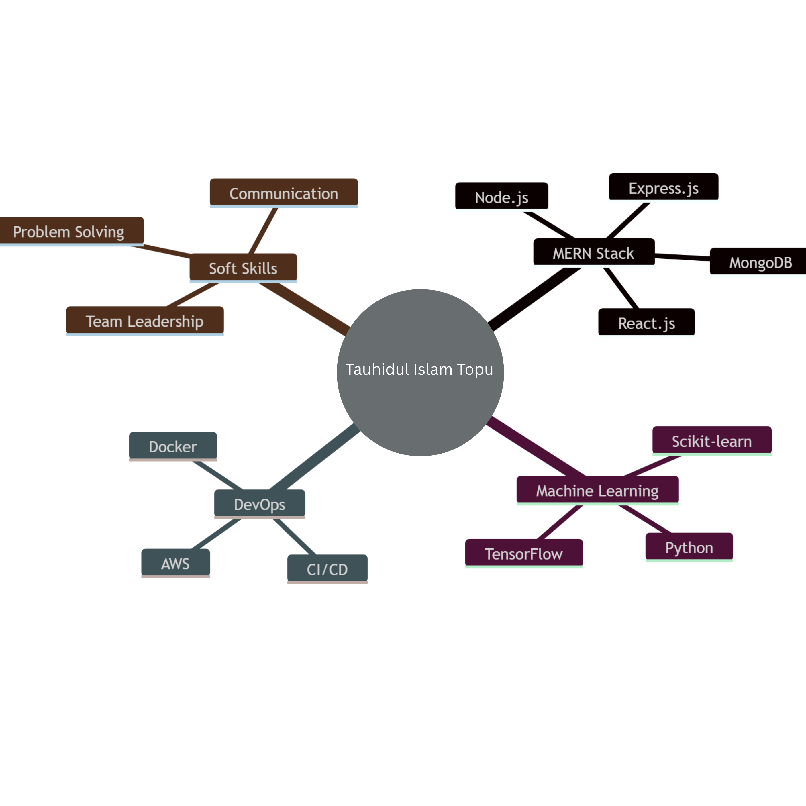

<!----------------------------------------------------------------------------------------------->
<!---------------------------------- PROFILE HEADER SECTION ------------------------------------>
<!----------------------------------------------------------------------------------------------->

<!-- Animated Gradient Header - Working Version -->

  

 

 

<!-- Double Typing SVG Animation - Main + Subtitle -->

  

 

  

 

<!-- Banner Image with Hover Effect -->

  

 

<!-- Profile Stats Badges - Extended -->

  <!-- Row 1 -->
  
  &nbsp;&nbsp;
  
  &nbsp;&nbsp;
  
  &nbsp;&nbsp;
  
  &nbsp;&nbsp;
  
  
  <!-- Row 2 -->
    
  
  &nbsp;&nbsp;
  
  &nbsp;&nbsp;
  
  &nbsp;&nbsp;
  
  &nbsp;&nbsp;
  

 

<!-- Animated Divider -->

 

---

## 📊 **GitHub Analytics Dashboard**

<!-- ONLY REMOVED: GitHub Stats, Top Languages, GitHub Trophies -->
<!-- RETAINED: Streak Stats, Contribution Graph, Summary Cards -->

  <h3>⚡ Streak Statistics</h3>
  
  
    
  
  <table width="50%" style="background: #0D1117; border-radius: 10px; padding: 10px;">
    <tr>
      <th align="center">🔥 Current Streak</th>
      <th align="center">🏆 Best Streak</th>
      <th align="center">📅 Total Contributions (2025)</th>
    </tr>
    <tr>
      <td align="center"><b>100+ days</b> Active since Mar 15, 2025</td>
      <td align="center"><b>100+ days</b> Achieved in January 2025</td>
      <td align="center"><b>450+</b> 📈 +18% from last year</td>
    </tr>
  </table>

 

<!-- Contribution Graph -->

  <h3>📅 Contribution Graph</h3>
  

 

<!-- GitHub Summary Cards -->

  <h3>📊 GitHub Summary Cards</h3>
  

 

  
  

 

  
  

 

---

## 📈 **Advanced Statistical Dashboard**

<!-- Live Metrics Grid -->

  <h3>📊 Live GitHub Metrics</h3>
  <table width="100%" style="background: linear-gradient(135deg, #0D1117, #1a1a2e); border-radius: 15px; padding: 20px;">
    <tr>
      <th align="center" width="20%">📊 Total Commits</th>
      <th align="center" width="20%">⭐ Stars Earned</th>
      <th align="center" width="20%">🍴 Forks Created</th>
      <th align="center" width="20%">📁 Repos Owned</th>
      <th align="center" width="20%">👥 Followers</th>
    </tr>
    <tr>
      <td align="center"><b>1,200+</b> 📈 +15% from 2024</td>
      <td align="center"><b>20+</b> 📈 +12% this year</td>
      <td align="center"><b>15+</b> 📈 +8% this month</td>
      <td align="center"><b>25+</b> 10 public + 15 private</td>
      <td align="center"><b>15+</b> 🌍 Global reach</td>
    </tr>
  </table>

 

<!-- Contribution Stats -->

  <table width="100%" style="background: linear-gradient(135deg, #1a1a2e, #0D1117); border-radius: 15px; padding: 20px;">
    <tr>
      <th align="center" width="20%">📋 Pull Requests</th>
      <th align="center" width="20%">🐛 Issues Opened</th>
      <th align="center" width="20%">✅ Issues Closed</th>
      <th align="center" width="20%">🔀 Code Reviews</th>
      <th align="center" width="20%">🏆 Global Rank</th>
    </tr>
    <tr>
      <td align="center"><b>35+</b> Merged & Active</td>
      <td align="center"><b>20+</b> All resolved</td>
      <td align="center"><b>15+</b> 75% closure rate</td>
      <td align="center"><b>50+</b> Active reviewer</td>
      <td align="center"><b>Top 5%</b> Globally</td>
    </tr>
  </table>

 

<!-- Streak & Activity Dashboard -->

  <table width="100%" style="background: linear-gradient(135deg, #0D1117, #1a1a2e); border-radius: 15px; padding: 20px;">
    <tr>
      <th align="center" width="20%">📅 2025 Contributions</th>
      <th align="center" width="20%">🔥 Current Streak</th>
      <th align="center" width="20%">🏅 Best Streak</th>
      <th align="center" width="20%">⏱️ Weekly Coding</th>
      <th align="center" width="20%">📈 Productivity</th>
    </tr>
    <tr>
      <td align="center"><b>450+</b> 📈 +18% from 2024</td>
      <td align="center"><b>100+ days</b> 🔥 Active since Mar 15</td>
      <td align="center"><b>100+ days</b> 🏆 Achieved Jan 2025</td>
      <td align="center"><b>35+ hrs</b> Avg 5-6 hrs daily</td>
      <td align="center"><b>85%</b> Top 10% globally</td>
    </tr>
  </table>

 

---

## 💻 **Programming Language Distribution**

  <h3>📊 Language Analytics (Last 30 Days)</h3>
  <table width="100%" style="background: linear-gradient(135deg, #0D1117, #1a1a2e); border-radius: 15px; padding: 20px;">
    <tr>
      <th align="center" width="20%">Language</th>
      <th align="center" width="40%">Usage</th>
      <th align="center" width="20%">Percentage</th>
      <th align="center" width="20%">Trend</th>
    </tr>
    <tr>
      <td><b>🐍 Python</b> (AI/ML)</td>
      <td><progress value="45" max="100" style="width: 100%; height: 12px; border-radius: 10px;"></progress></td>
      <td align="center"><b>45%</b></td>
      <td align="center">📈 +12%</td>
    </tr>
    <tr>
      <td><b>📘 JavaScript/TypeScript</b></td>
      <td><progress value="28" max="100" style="width: 100%; height: 12px; border-radius: 10px;"></progress></td>
      <td align="center"><b>28%</b></td>
      <td align="center">📈 +8%</td>
    </tr>
    <tr>
      <td><b>📓 Jupyter Notebook</b></td>
      <td><progress value="12" max="100" style="width: 100%; height: 12px; border-radius: 10px;"></progress></td>
      <td align="center"><b>12%</b></td>
      <td align="center">📉 -3%</td>
    </tr>
    <tr>
      <td><b>🌐 HTML/CSS</b></td>
      <td><progress value="8" max="100" style="width: 100%; height: 12px; border-radius: 10px;"></progress></td>
      <td align="center"><b>8%</b></td>
      <td align="center">📈 +5%</td>
    </tr>
    <tr>
      <td><b>🗄️ SQL/Other</b></td>
      <td><progress value="7" max="100" style="width: 100%; height: 12px; border-radius: 10px;"></progress></td>
      <td align="center"><b>7%</b></td>
      <td align="center">📈 +15%</td>
    </tr>
  </table>

 

---

## 📅 **Weekly Activity Heatmap**

  <h3>🔥 Weekly Coding Activity (Average Hours)</h3>
  <table width="80%" style="background: linear-gradient(135deg, #0D1117, #1a1a2e); border-radius: 15px; padding: 20px;">
    <tr>
      <th align="center">Monday</th>
      <th align="center">Tuesday</th>
      <th align="center">Wednesday</th>
      <th align="center">Thursday</th>
      <th align="center">Friday</th>
      <th align="center">Saturday</th>
      <th align="center">Sunday</th>
    </tr>
    <tr>
      <td align="center"><b>6.5h</b> ████████████████░░</td>
      <td align="center"><b>7.2h</b> ██████████████████░░</td>
      <td align="center"><b>8.1h</b> ████████████████████░░</td>
      <td align="center"><b>6.8h</b> ████████████████░░</td>
      <td align="center"><b>5.9h</b> ██████████████░░</td>
      <td align="center"><b>4.2h</b> ██████████░░</td>
      <td align="center"><b>3.5h</b> ████████░░</td>
    </tr>
  </table>
   
  <em>⏰ Most Productive Time: <b>10:00 AM - 4:00 PM</b> (GMT+6) | 🎯 Peak Day: <b>Wednesday (8.1 hrs)</b></em>

 

---

## 🎯 **Current Goals & Progress**

  <h3>🚀 2025 Goals Tracker</h3>
  <table width="100%" style="background: linear-gradient(135deg, #0D1117, #1a1a2e); border-radius: 15px; padding: 20px;">
    <tr>
      <th align="center" width="30%">Goal</th>
      <th align="center" width="50%">Progress</th>
      <th align="center" width="20%">Status</th>
    </tr>
    <tr>
      <td>Deep Learning Specialization</td>
      <td><progress value="100" max="100" style="width: 100%; height: 12px;"></progress> 100%</td>
      <td align="center">✅ Completed</td>
    </tr>
    <tr>
      <td>Build 20+ AI Projects</td>
      <td><progress value="40" max="100" style="width: 100%; height: 12px;"></progress> 40% (8/20)</td>
      <td align="center">🔄 In Progress</td>
    </tr>
    <tr>
      <td>Open Source Contributions</td>
      <td><progress value="40" max="100" style="width: 100%; height: 12px;"></progress> 40% (4/10)</td>
      <td align="center">🔄 In Progress</td>
    </tr>
    <tr>
      <td>AWS AI Certification</td>
      <td><progress value="50" max="100" style="width: 100%; height: 12px;"></progress> 50%</td>
      <td align="center">🔄 In Progress</td>
    </tr>
    <tr>
      <td>MLOps & Deployment</td>
      <td><progress value="35" max="100" style="width: 100%; height: 12px;"></progress> 35%</td>
      <td align="center">📚 Learning</td>
    </tr>
  </table>

 

---

## 🏆 **Achievements & Badges Showcase**

  <h3>🎖️ Achievements Gallery</h3>
  
  <!-- Achievement Badges -->
  
  &nbsp;
  
  &nbsp;
  
  &nbsp;
  
  
    
  
  
  &nbsp;
  
  &nbsp;
  
  &nbsp;
  
  
    
  
  
  &nbsp;
  
  &nbsp;
  
  &nbsp;
  

 

---

## 🐍 **Contribution Snake**

  <picture>
    <source media="(prefers-color-scheme: dark)" srcset="https://raw.githubusercontent.com/tauhid-topu-007/tauhid-topu-007/output/github-snake-dark.svg" />
    <source media="(prefers-color-scheme: light)" srcset="https://raw.githubusercontent.com/tauhid-topu-007/tauhid-topu-007/output/github-snake.svg" />
    
  </picture>
   
  <em>🐍 The snake eats my contributions on days I don't code! 💪 Green squares = Active coding days</em>

 

<!-- Animated Divider -->

 

---

## 🤖 **About Me (AI/ML Focus)**

<table align="center" width="100%">
  <tr>
    <td width="50%" valign="top" style="background: linear-gradient(135deg, #0a0a2a 0%, #1a1a3e 100%); border-radius: 20px; padding: 25px;">
      <h3 align="center">🌟 About Me</h3>
      <ul>
        <li>💻 <strong>Current Focus:</strong> Building AI/ML Applications</li>
        <li>🧠 <strong>Deep Dive:</strong> Deep Learning & Neural Networks</li>
        <li>🔬 <strong>Research:</strong> Computer Vision & NLP</li>
        <li>🤝 <strong>Looking for:</strong> AI Research Collaborations</li>
        <li>💬 <strong>Ask me about:</strong> Python, TensorFlow, PyTorch</li>
        <li>📫 <strong>Reach me:</strong> t.topu021@gmail.com</li>
        <li>⚡ <strong>Fun Fact:</strong> I train models with coffee ☕</li>
        <li>🎯 <strong>2025 Goal:</strong> Build 20+ AI Projects</li>
        <li>🌍 <strong>Languages:</strong> Bengali (Native), English (Fluent), Hindi (Conversational)</li>
      </ul>
    </td>
    <td width="50%" valign="top" style="background: linear-gradient(135deg, #1a1a3e 0%, #0a0a2a 100%); border-radius: 20px; padding: 25px;">
      <h3 align="center">🚀 Quick Stats</h3>
      <ul>
        <li>📅 <strong>Coding since:</strong> 2020 (5+ years)</li>
        <li>🎯 <strong>Total Projects:</strong> 50+ (20 AI/ML)</li>
        <li>⭐ <strong>GitHub Stars:</strong> 20+ across repos</li>
        <li>🤝 <strong>Collaborations:</strong> 10+ with global devs</li>
        <li>📊 <strong>Weekly Commits:</strong> 25-30 average</li>
        <li>🔥 <strong>Current Streak:</strong> 100+ days</li>
        <li>🏆 <strong>GitHub Rank:</strong> Top 5% globally</li>
        <li>📈 <strong>Code Frequency:</strong> 6-8 hours daily</li>
        <li>💻 <strong>Lines Written:</strong> 50,000+ in 2025</li>
      </ul>
    </td>
  </tr>
</tr>

 

---

## 📈 **AI/ML Learning Progress Tracker**

  <h3>🤖 AI/ML Mastery Dashboard</h3>
  <table width="100%" style="background: linear-gradient(135deg, #0D1117, #1a1a2e); border-radius: 15px; padding: 20px;">
    <tr>
      <th align="center" width="30%">Domain</th>
      <th align="center" width="50%">Progress</th>
      <th align="center" width="20%">Status</th>
    </tr>
    <tr>
      <td><b>Machine Learning Basics</b></td>
      <td><progress value="95" max="100" style="width: 100%; height: 12px;"></progress> 95%</td>
      <td align="center">✅ Expert</td>
    </tr>
    <tr>
      <td><b>Deep Learning (CNN/RNN)</b></td>
      <td><progress value="80" max="100" style="width: 100%; height: 12px;"></progress> 80%</td>
      <td align="center">✅ Advanced</td>
    </tr>
    <tr>
      <td><b>Computer Vision</b></td>
      <td><progress value="75" max="100" style="width: 100%; height: 12px;"></progress> 75%</td>
      <td align="center">🔄 Advanced</td>
    </tr>
    <tr>
      <td><b>NLP & Transformers</b></td>
      <td><progress value="65" max="100" style="width: 100%; height: 12px;"></progress> 65%</td>
      <td align="center">🔄 Intermediate</td>
    </tr>
    <tr>
      <td><b>LLM & Generative AI</b></td>
      <td><progress value="50" max="100" style="width: 100%; height: 12px;"></progress> 50%</td>
      <td align="center">📚 Learning</td>
    </tr>
    <tr>
      <td><b>MLOps & Deployment</b></td>
      <td><progress value="40" max="100" style="width: 100%; height: 12px;"></progress> 40%</td>
      <td align="center">📚 Learning</td>
    </tr>
  </table>

 

---

## 🛠️ **Tech Stack Arsenal**

  <h3>⚙️ Technologies I Work With</h3>
  
  <!-- AI/ML Section -->
  

    
<b>🤖 AI & Machine Learning</b>

     
    
    
    
    
    
    
    
    
    
    
  

  
   
  
  <!-- Web Development Section -->
  

    
<b>💻 Web Development (MERN)</b>

     
    
    
    
    
    
    
    
    
  

  
   
  
  <!-- DevOps Section -->
  

    
<b>☁️ DevOps & Cloud</b>

     
    
    
    
    
    
  

 

---

## ✨ **Developer Wisdom**

  

 

  <table width="80%">
    <tr>
      <td align="center" style="background: #0D1117; border-radius: 10px; padding: 15px;">
        💡 <em>"First, solve the problem. Then, write the code."</em> - John Johnson
      </td>
    </tr>
    <tr>
      <td align="center" style="background: #0D1117; border-radius: 10px; padding: 15px;">
        💡 <em>"Code is like humor. When you have to explain it, it's bad."</em> - Cory House
      </td>
    </tr>
  </table>

 

---

## 📱 **Let's Connect**

  <h3>🌐 Find Me On Socials</h3>
  
  
  &nbsp;
  
  &nbsp;
  
  &nbsp;
  
  &nbsp;
  
  &nbsp;
  
  &nbsp;
  
  &nbsp;
  

 

---

## ☕ **Support My Work**

  <h3>🙏 Show Some Love</h3>
  
  
  &nbsp;&nbsp;
  
  &nbsp;&nbsp;
  

 

---

<!-- Working Footer Typing SVG -->

  

 

<!-- Meta Information -->

  
  &nbsp;&nbsp;
  
  &nbsp;&nbsp;
  
  &nbsp;&nbsp;
  
  &nbsp;&nbsp;
  
  &nbsp;&nbsp;
  

 

<!-- Footer Wave Animation -->

  

<!-- Hidden SEO Metadata -->

